# A TensorFlow implementation of VQVAE paper

This is a TensorFlow implementation of the [Vector Quantised-Variational AutoEncoder](https://papers.nips.cc/paper/7210-neural-discrete-representation-learning.pdf) for voice conversion.

## Features
- VQVAE for voice conversion
- WaveNet which allows local conditioning

## Requirements
Code is tested on TensorFlow version 1.4 for Python 3.6.

In addition, [librosa](https://github.com/librosa/librosa) must be installed for reading and writing audio.

## Simple test

In this test, we generate 3-type wavs and each type has different style each other.

See below generated examples for train.

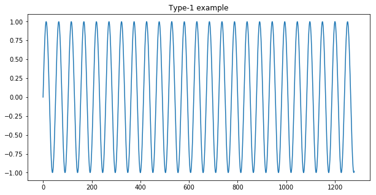
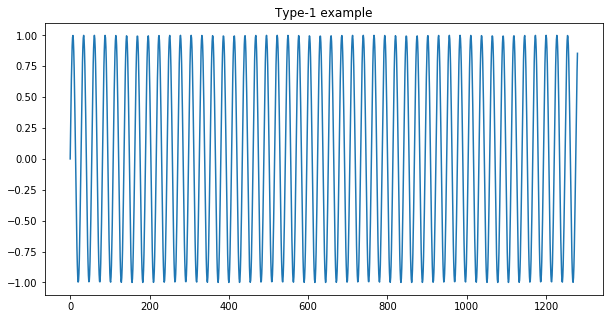
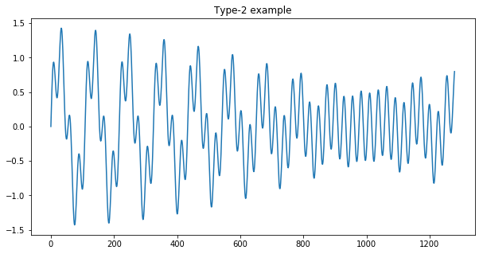
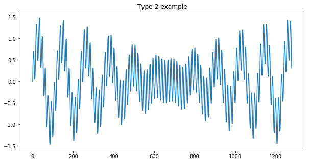
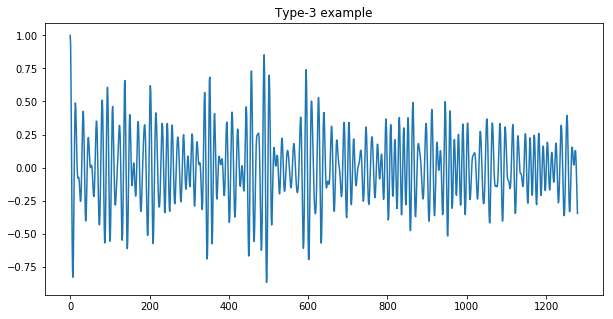
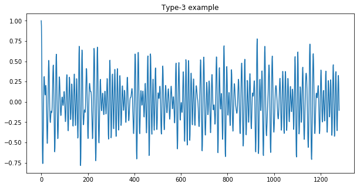

### Results
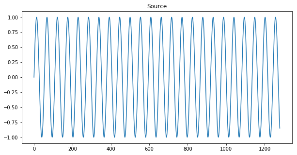
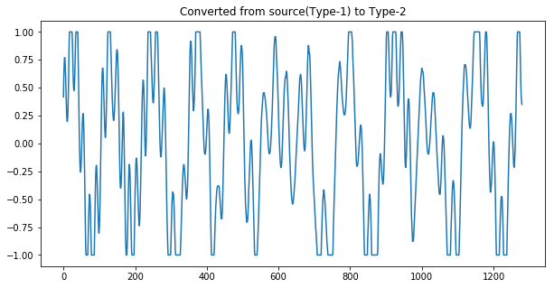
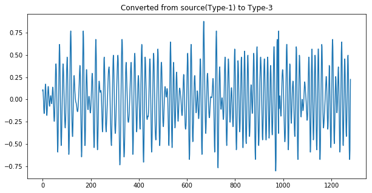
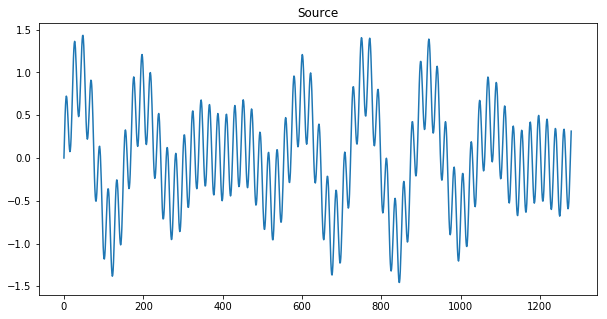
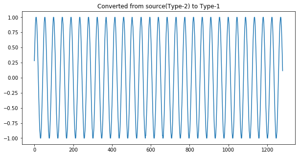

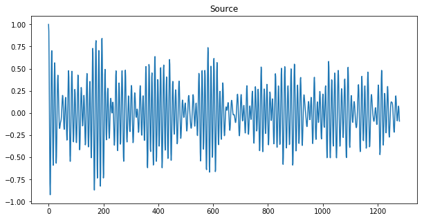
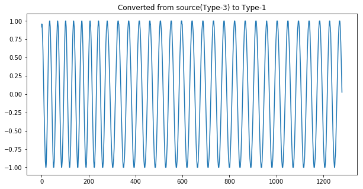
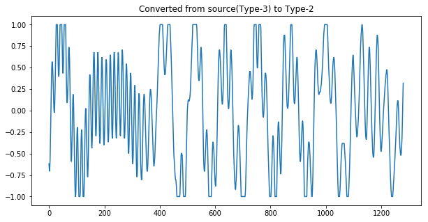

You can find more details in <a href="./notebooks/simple vq-vae test.ipynb">simple vq-vae test</a> and the generated files are on <a href="./results">results</a> folder.

## Voice conversion test
~~This will be updated soon.~~ Recently, I'm focus on [wavenet project](https://github.com/twidddj/wavenet). After build vocoder, I'll go on this test.

## References
- [VQVAE](https://github.com/hiwonjoon/tf-vqvae), a VQVAE for image generation
- [wavenet](https://github.com/ibab/tensorflow-wavenet), a wavenet
#

[Ali Zahedi](https://github.com/alixahedi)

Student number:  40012340048010

Digital signal processing course

Professor Dr. Mahdi Eslami
#

#### 1. Summary 

Learning useful representations without supervision remains a key challenge in  machine learning. Our model, the Vector QuantisedVariational AutoEncoder (VQ-VAE), differs from VAEs in two key ways: the encoder network outputs discrete, rather than continuous, codes; and the prior is learnt rather than static. In order to learn a discrete latent representation, we  incorporate ideas from vector quantisation (VQ).
Using the VQ method allows the  model to circumvent issues of “posterior collapse” -— where the latents are ignored  when they are paired with a powerful autoregressive decoder -— typically observed  in the VAE framework. Pairing these representations with an autoregressive prior,  the model can generate high quality images, videos, and speech as well as doing  high quality speaker conversion and unsupervised learning of phonemes, providing  further evidence of the utility of the learnt representations.
#

#### 2. [Innovation](https://github.com/mahdeslami11/vqvae/edit/master/README.md)
#

#### 3. [Items that have been changed and improved in the source code](https://github.com/mahdeslami11/vqvae/blob/master/vqvae/AudioReader.py)

#

#### 4. [Innovation result](https://github.com/mahdeslami11/vqvae/edit/master/README.md)
#

#### 5. [Main source](https://github.com/twidddj/vqvae) 
#

#### 6. Student Introduction
I am Ali Zahedi, a master's student in the field of electronic engineering, majoring in Digital electronic systems, from Islamic Azad University, Science and Research Branch, Tehran, Iran. I am an embedded systems developer and I have been working in this field for about 6 years. You can see my full resume through my [LinkedIn](https://www.linkedin.com/in/ali-zahedi-b5a360158).
#

#### 7. [Article Link](https://github.com/mahdeslami11/vqvae/blob/master/NIPS-2017-neural-discrete-representation-learning-Paper_2.pdf)
#

#### 8. [Video Link](https://drive.google.com/file/d/1MfG7_P5hCMxa1zNLGGV-6SGYX0z3cQQ5/view?usp=sharing)
#

#### 9. [Proposal Link](https://github.com/mahdeslami11/vqvae/blob/master/Proposal.docx)

